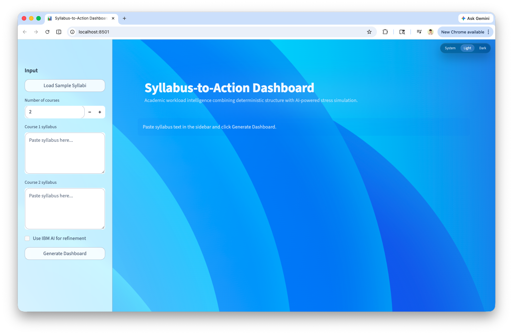
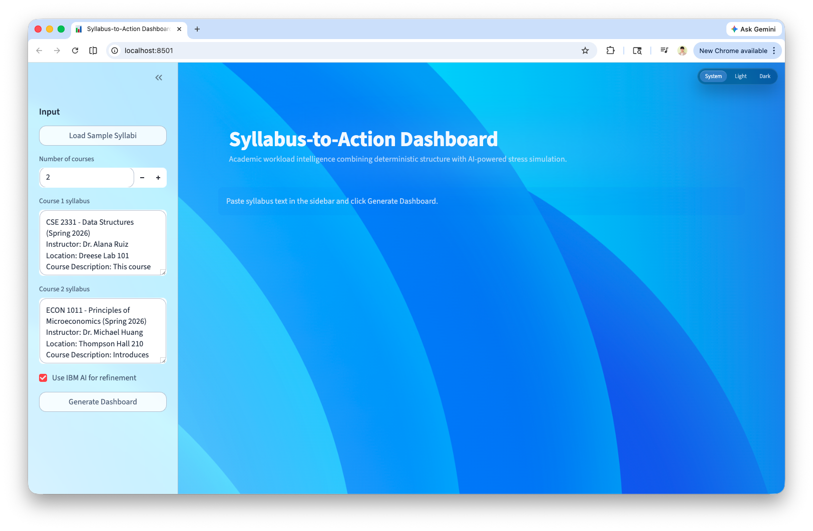
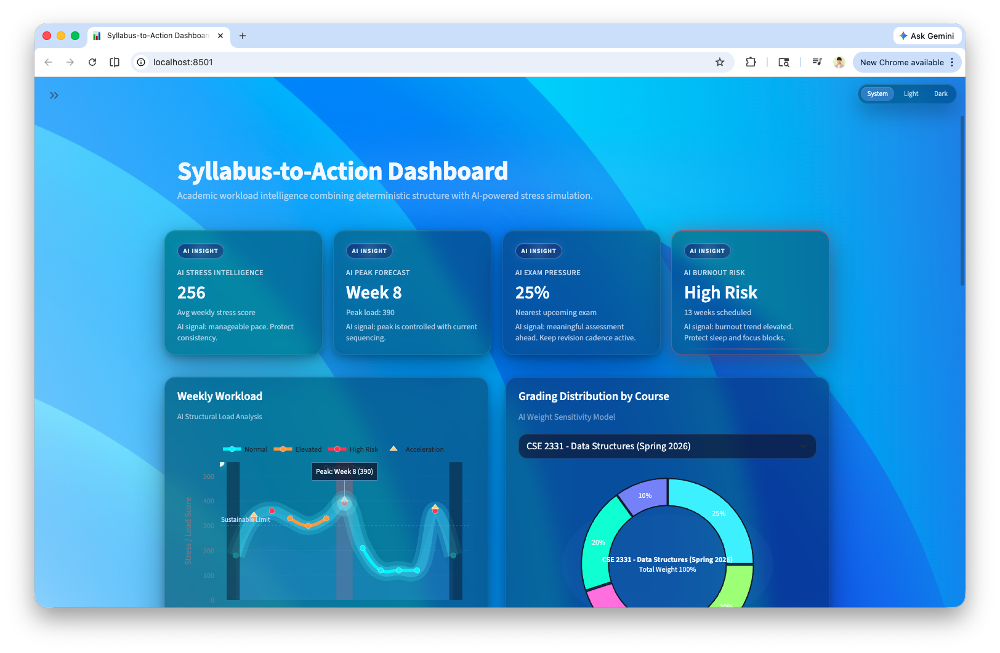
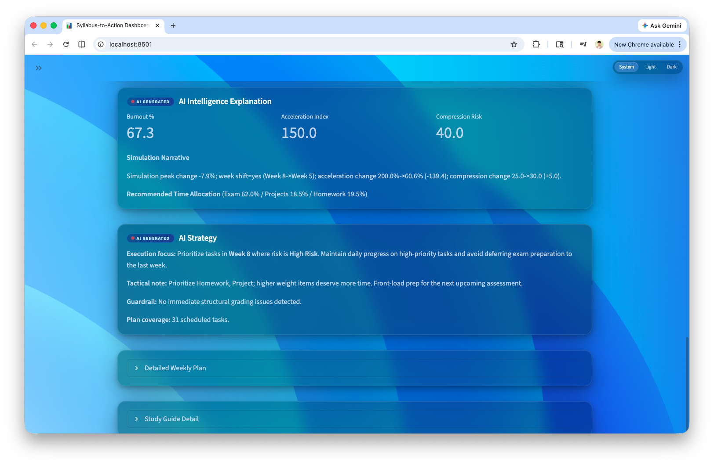
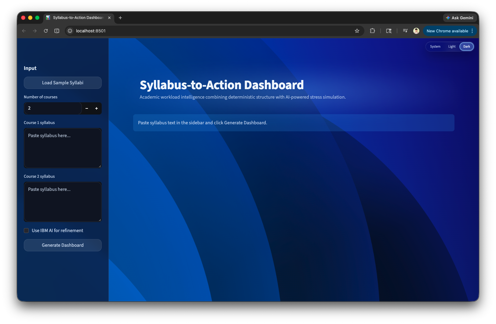
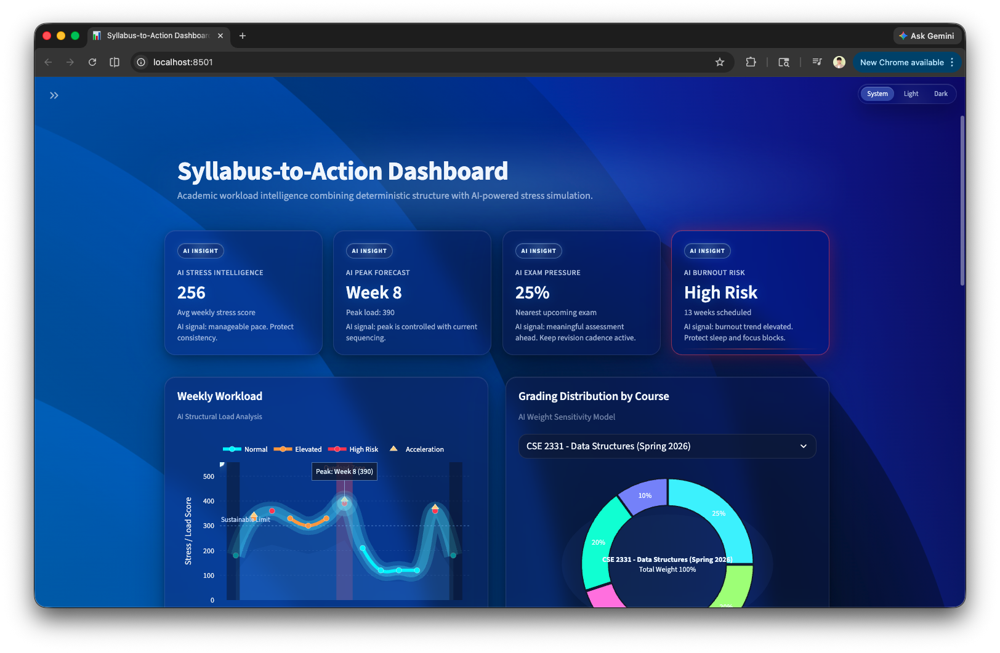
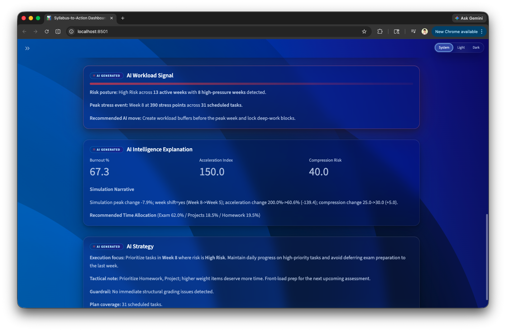

# Syllabus-to-Action AI

AI-powered hackathon project that turns unstructured course syllabi into prioritized, actionable weekly study plans.

> **Project type:** Portfolio demo + prototype (hackathon-ready, production-friendly architecture)

## Hackathon context
This project was built as a rapid-response demo focused on one pain point students repeatedly face: taking detailed syllabi and translating them into a weekly execution plan.

The baseline app (`app.py`) remains stable and deterministic, with optional AI refinement via IBM WatsonX when credentials are configured.

## What runs what
- `app.py`: core planning engine shell used for validation and quick smoke checks.
- `dashboard_app.py`: final portfolio web app with polished UI/UX. Public screenshots, demos, and user-facing behavior are based on this file.

## What it does
- Converts multiple syllabi into structured tasks (assignments, quizzes, milestones, exams)
- Generates weekly workload-aware to-do lists
- Prioritizes by urgency + grading weight + risk
- Produces a course-level study guide summary
- Explains why high-stress periods are risky
- Keeps core planning deterministic even when AI is unavailable

## Tech stack
- **Python 3.10+**
- **Streamlit** for web UI
- **IBM WatsonX + Granite** (optional AI refinement path)
- **Regex / parser rules + scheduling engine** in `parser/` and `planner/`

## Repository structure
```text
syllabus-to-action-ai/
├── app.py                     # Core engine validation shell (streamlit)
├── dashboard_app.py           # Final portfolio Streamlit app
├── requirements.txt           # Python dependencies
├── .env.example               # Optional WatsonX credentials template
├── .github/                  # GitHub workflows and templates
│   └── workflows/
│       └── ci.yml            # Compile/import + secret scan
├── Makefile                  # Quick developer commands
├── LICENSE                   # MIT
├── ai/                       # AI + planning engine glue
├── parser/                   # Syllabus parsing logic
├── planner/                  # Deterministic weekly planner
├── data/                     # Mock syllabi used for manual testing
├── assets/                   # UI assets (themes, background visuals)
├── scripts/                  # Utility/test scripts
├── docs/                     # Project documentation
│   ├── ARCHITECTURE.md
│   ├── DESIGN.md
│   ├── INSTALL.md
│   ├── USAGE.md
│   ├── CONTRIBUTING.md
│   ├── RELEASE_NOTES.md
│   ├── CHANGELOG.md
│   ├── screenshots/
│   └── media/                # Demo video and media assets
└── .gitignore
```

## Quick start
### 1) Install dependencies
```bash
python -m venv .venv
source .venv/bin/activate  # macOS/Linux
python -m pip install -r requirements.txt
```

### 2) Run the app
Use `app.py` first if you want to verify core behavior:
```bash
streamlit run app.py
```

Use `dashboard_app.py` for the final UI demo and portfolio artifact:
```bash
streamlit run dashboard_app.py
```

You can also use Makefile shortcuts:
```bash
make setup      # install dependencies
make run        # run app.py
make run-dashboard # run dashboard_app.py
make verify     # compile + import smoke checks
```

### 3) (Optional) enable AI refinement
1. Set `WATSONX_API_KEY` and `WATSONX_URL` environment variables
2. (Optional but recommended) set `WATSONX_PROJECT_ID`
3. In the app, toggle **Use IBM AI for refinement**
4. Keep default deterministic mode if you want reproducible results without external dependencies

Example `.env`:
```bash
WATSONX_API_KEY=...
WATSONX_URL=https://...
WATSONX_PROJECT_ID=...
```

## Example usage
1. Open the app and choose the number of courses.
2. Paste each syllabus into the text area.
3. Click **Generate Plan**.
4. Review:
   - `Weekly To-Do Lists`
   - `Study Guide`
   - summary cards (focus tasks + upcoming high-stakes assessments)

You can also use the sample button in the UI to quickly load mock syllabi and verify output end-to-end.

## Screenshots
### UI snapshots

Screenshots live in `docs/screenshots/`.
All screenshots are captured from the final app interface in `dashboard_app.py`.

### Light mode flow
- Home / landing
<a href="docs/screenshots/app-home-light.png"></a>
- Syllabus input
<a href="docs/screenshots/app-input.png"></a>
- Weekly plan output
<a href="docs/screenshots/app-output-light-1.png"></a>
<a href="docs/screenshots/app-output-light-2.png"></a>

### Dark mode flow
- Home / landing
<a href="docs/screenshots/app-home-dark.png"></a>
- Weekly plan output
<a href="docs/screenshots/app-output-dark-1.png"></a>
<a href="docs/screenshots/app-output-dark-2.png"></a>

## Demo assets
- [Final demo walkthrough (Google Drive)](https://drive.google.com/file/d/1LKwuDc0zfOlJM4A36M-e12_vtSoYhLCn/view?usp=sharing)
- [Final demo media download (MP4)](https://drive.google.com/uc?export=download&id=1LKwuDc0zfOlJM4A36M-e12_vtSoYhLCn)

## API / behavior notes
- Core planning is deterministic by default for stable results.
- AI refinement is additive and guarded behind a strict validation + fallback path.
- The planner output contracts are defined by module boundaries in `parser/`, `planner/`, and `ai/`.

## Developer experience improvements
- Primary documentation now lives in one place: `docs/`
- `app.py` is the explicit engine validation entrypoint; `dashboard_app.py` is the final web deliverable
- Optional helper script is separated into `scripts/`
- Lightweight structure makes onboarding new contributors easy

## Public project checklist
- [x] Clear entrypoint split: engine validation (`app.py`) and final web UI (`dashboard_app.py`)
- [x] Reproducible setup (`requirements.txt`, `Makefile`, `.env.example`)
- [x] Documentation consolidated under `docs/`
- [x] CI guardrails (`.github/workflows/ci.yml`)
- [x] Open-source license (`LICENSE`)

## Contributing
See [docs/CONTRIBUTING.md](docs/CONTRIBUTING.md)

## Security
See [SECURITY.md](SECURITY.md) for responsible vulnerability reporting.

## Repo health checks
- `make verify` (or CI): compile/import checks + lightweight secret scan
